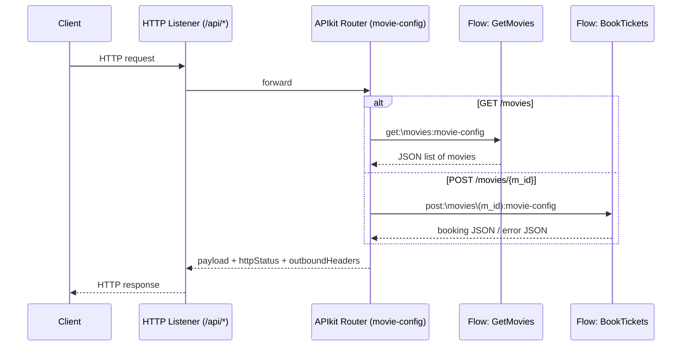

# API Endpoints

The API surface is defined by the RAML contract
`dd352549-b3e6-4dd6-b86f-85ed018825af:movie:1.0.0:raml` referenced from
[`interface.xml`](../../mulesoft/src/main/mule/interface.xml) and dispatched by
the APIkit router (`movie-config`). All endpoints are served by the
`movie-httpListenerConfig` HTTP listener on `0.0.0.0:${http.port}` (default
`8081`) under the base path `/api`.

## Endpoint summary

| Method | Path                         | Implementation flow | Purpose                                   |
|--------|------------------------------|---------------------|-------------------------------------------|
| GET    | `/api/movies`                | `GetMovies`         | List movies that still have seats         |
| POST   | `/api/movies/{m_id}`         | `BookTickets`       | Book `no_tickets` seats for movie `m_id`  |
| GET    | `/console/*`                 | `movie-console`     | APIkit console (interactive API explorer) |

The mapping is wired in `interface.xml`:

```xml
<flow name="get:\movies:movie-config">
    <flow-ref name="GetMovies"/>
</flow>
<flow name="post:\movies\(m_id):movie-config">
    <flow-ref name="BookTickets"/>
</flow>
```

## High‑level request routing



---

## 1. `GET /api/movies` — List available movies

Returns every row in `movie_table` whose `m_available` count is greater than
zero. The flow performs a single `SELECT` and serialises the result as JSON.

### Request

- **Method:** `GET`
- **Path:** `/api/movies`
- **Headers:** none required
- **Query parameters:** none
- **Body:** none

### Response

- **Status:** `200 OK`
- **Content-Type:** `application/json`
- **Body:** JSON array of movie rows. Based on the autogenerated type
  `auto_4c5336f2-..._Output-Payload` in
  [`application-types.xml`](../../mulesoft/src/main/resources/application-types.xml)
  the shape per item is:

  | Field           | Type    | Notes                              |
  |-----------------|---------|------------------------------------|
  | `id`            | string  | Movie identifier (`m_id`)          |
  | `name`          | string  | Movie name                         |
  | `no_of_tickets` | integer | Available tickets (`m_available`)  |

Sample (from the autogenerated type metadata):

```json
[
  { "id": "1", "name": "abc", "no_of_tickets": 100 }
]
```

> Note: the DataWeave transform in `GetMovies` is `output application/json ---
> payload`, so the actual JSON keys mirror the database column names
> (`m_id`, `m_name`, `m_available`, …). The "id / name / no_of_tickets" shape
> above is the documented logical contract.

---

## 2. `POST /api/movies/{m_id}` — Book tickets

Books `no_tickets` seats for movie `m_id`, applying tiered pricing and updating
inventory. Both inputs are taken from the URL — `m_id` from the path and
`no_tickets` from the query string (per
`auto_2df5fe63-..._Input-Attributes` in `application-types.xml`).

### Request

- **Method:** `POST`
- **Path:** `/api/movies/{m_id}`
- **Path parameters:**
  - `m_id` *(string, required)* — id of the movie to book.
- **Query parameters:**
  - `no_tickets` *(integer, required)* — number of seats to book (must be ≥ 1).
- **Body:** none required.

Example: `POST /api/movies/2?no_tickets=3`

### Successful response

- **Status:** `200 OK`
- **Content-Type:** `application/json`
- **Body:** JSON serialisation of the just‑created `order_table` row (the flow
  re‑selects `WHERE o_id = (SELECT MAX(o_id) FROM order_table)` and returns it).

  | Field        | Type    | Notes                                              |
  |--------------|---------|----------------------------------------------------|
  | `o_id`       | integer | Order id (auto‑generated primary key)              |
  | `m_id`       | integer | Movie id                                           |
  | `no_tickets` | integer | Number of tickets booked                           |
  | `price`      | integer | Total price computed by the tiered pricing rules   |

  The logical confirmation shape documented in the autogenerated output type is
  `{ "message": "ticket(s) booked" }`; the runtime payload returned by the
  current flow is the order row as described above.

Sample:

```json
{ "o_id": 17, "m_id": 2, "no_tickets": 3, "price": 300 }
```

### Validation / business errors

When the requested `no_tickets` exceeds the available seats, the
`validation:is-true` step fails with `VALIDATION:INVALID_BOOLEAN` and the
`on-error-continue` handler returns:

- **Status:** `200 OK` (the error is swallowed by `on-error-continue`)
- **Content-Type:** `application/json`
- **Body:**

```json
{ "error": "avaible tickets is only <m_available> but you have ordered <no_tickets>" }
```

### Pricing tiers

Computed in DataWeave inside the `INSERT` into `order_table`:

| `no_tickets` (`n`) | Unit price | Total price |
|--------------------|------------|-------------|
| `n ≤ 5`            | 100        | `n * 100`   |
| `5 < n ≤ 10`       | 90         | `n * 90`    |
| `n > 10`           | 80         | `n * 80`    |

---

## APIkit error responses

The `movie-main` flow defines an `error-handler` that maps standard APIkit
errors to JSON responses:

| Error type                        | HTTP status | Body                                  |
|-----------------------------------|-------------|---------------------------------------|
| `APIKIT:BAD_REQUEST`              | 400         | `{ "message": "Bad request" }`        |
| `APIKIT:NOT_FOUND`                | 404         | `{ "message": "Resource not found" }` |
| `APIKIT:METHOD_NOT_ALLOWED`       | 405         | `{ "message": "Method not allowed" }` |
| `APIKIT:NOT_ACCEPTABLE`           | 406         | `{ "message": "Not acceptable" }`     |
| `APIKIT:UNSUPPORTED_MEDIA_TYPE`   | 415         | `{ "message": "Unsupported media type" }` |
| `APIKIT:NOT_IMPLEMENTED`          | 501         | `{ "message": "Not Implemented" }`    |

The `movie-console` flow has its own minimal handler that only maps
`APIKIT:NOT_FOUND` to a 404 JSON response.
