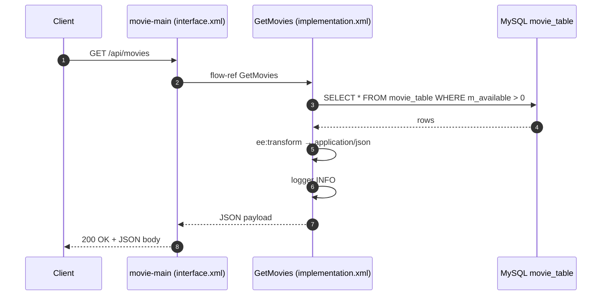
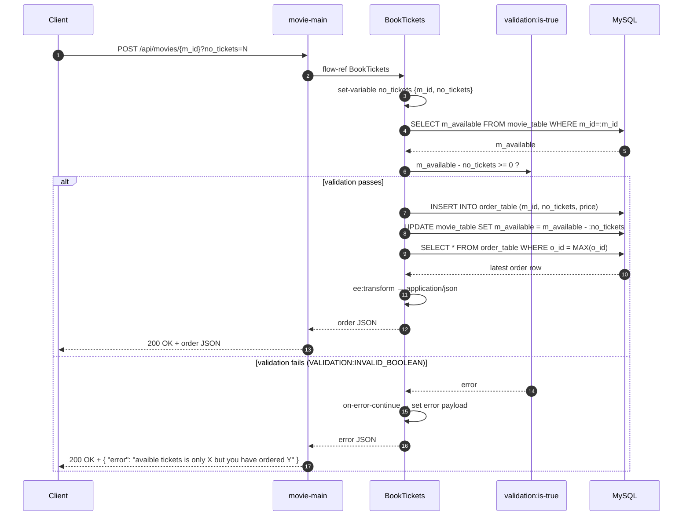
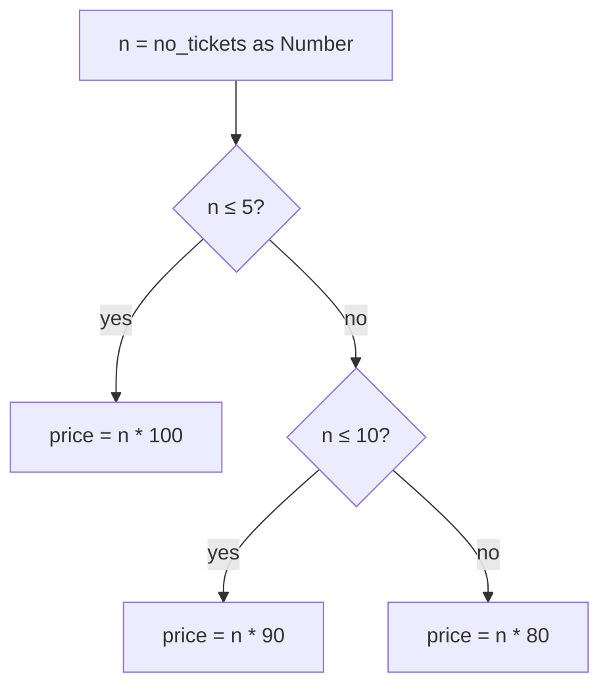
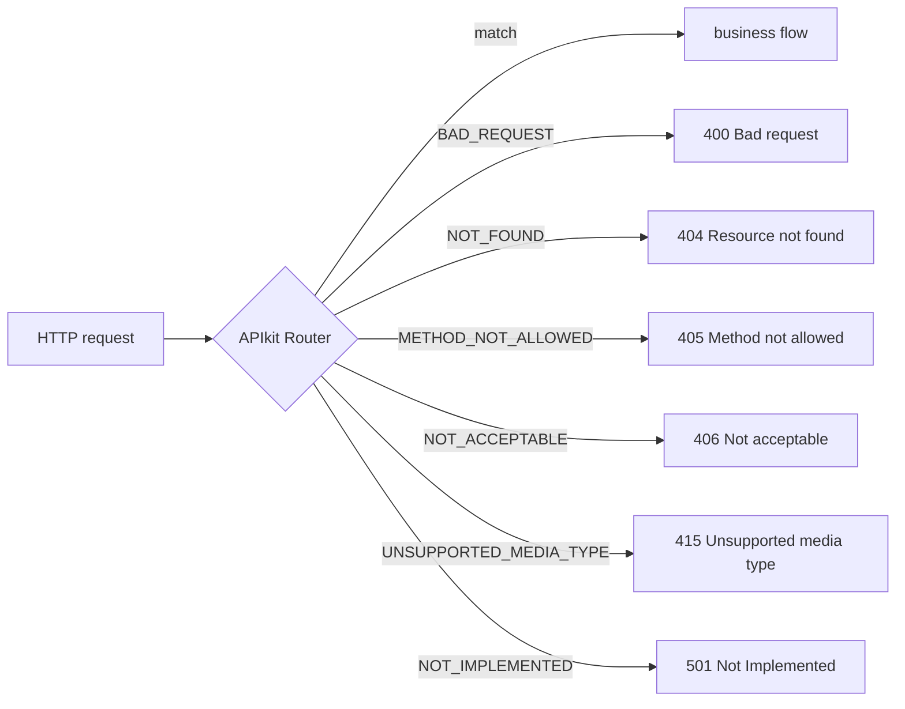

# Business Logic

This document describes the behaviour of each Mule flow defined under
[`mulesoft/src/main/mule/`](../../mulesoft/src/main/mule), in particular the
two business flows in
[`implementation.xml`](../../mulesoft/src/main/mule/implementation.xml):
`GetMovies` and `BookTickets`. Together they implement the ticket‑booking
business rules of the legacy Book My Show application.

## Flow inventory

| Flow              | File                | Trigger                              | Responsibility                                         |
|-------------------|---------------------|--------------------------------------|--------------------------------------------------------|
| `movie-main`      | `interface.xml`     | HTTP listener `/api/*`               | Front‑door for the API; APIkit routing + error mapping |
| `movie-console`   | `interface.xml`     | HTTP listener `/console/*`           | APIkit interactive console                             |
| `GetMovies`       | `implementation.xml`| `flow-ref` from `get:\movies`        | Return movies with available seats                     |
| `BookTickets`     | `implementation.xml`| `flow-ref` from `post:\movies\(m_id)`| Book tickets, compute price, update inventory          |

---

## Flow: `GetMovies`

### Purpose

Return all movies that currently have at least one seat available, so that the
client can show them to the end user.

### Steps

1. **`db:select`** — Run `SELECT * FROM movie_table WHERE m_available > 0`
   against `Database_Config` (MySQL).
2. **`ee:transform`** — Convert the database result set to JSON via
   `%dw 2.0 output application/json --- payload`.
3. **`logger`** — Log the transformed payload at `INFO` level.

The flow then returns to `movie-main` and the JSON payload is sent back over
HTTP.

### Inputs / Outputs

- **Input:** none (no path/query/body parameters used).
- **Output:** JSON array of movie rows (see
  [`api-endpoints.md`](api-endpoints.md#1-get-apimovies--list-available-movies)).

### Sequence diagram



---

## Flow: `BookTickets`

### Purpose

Atomically(*) reserve `no_tickets` seats for a given `m_id`, charging a price
based on a tiered pricing schedule, and decrement the movie's available seat
count.

(*) The current implementation runs the steps sequentially without a database
transaction, so a strictly atomic guarantee is not enforced. The .NET re‑write
should wrap these steps in a transaction (see
[`integrations.md`](integrations.md#mysql-database)).

### Inputs

Both inputs are read from the HTTP request attributes (not the body):

| Source                       | Variable / field                | Type   |
|------------------------------|---------------------------------|--------|
| `attributes.uriParams.m_id`  | `vars.no_tickets.m_id`          | string |
| `attributes.queryParams.no_tickets` | `vars.no_tickets.no_tickets` | string (cast to Number) |

They are bundled into a single variable named `no_tickets` of shape
`{ m_id, no_tickets }` — see the `odder_details` type in
[`application-types.xml`](../../mulesoft/src/main/resources/application-types.xml).

### Steps

1. **`set-variable` — `no_tickets`**

   ```text
   {
     no_tickets: attributes.queryParams.no_tickets,
     m_id:       attributes.uriParams.m_id
   }
   ```

2. **`db:select`** — Read the current availability:

   ```sql
   SELECT m_available FROM movie_table WHERE m_id = :m_id
   ```

3. **`validation:is-true`** — Assert that there are enough seats:

   ```text
   (payload[0].m_available as Number) - (vars.no_tickets.no_tickets as Number) >= 0
   ```

   If false, the `validation` module raises `VALIDATION:INVALID_BOOLEAN` and
   the error handler below short‑circuits the flow.

4. **`db:insert`** — Persist the order with computed price:

   ```sql
   INSERT INTO order_table (m_id, no_tickets, price)
   VALUES (:m_id, :no_tickets, :price)
   ```

   `price` is computed in DataWeave with tiered rules:

   - `n ≤ 5`  → `n * 100`
   - `n ≤ 10` → `n * 90`
   - otherwise → `n * 80`

   (`n = vars.no_tickets.no_tickets as Number`)

5. **`db:update`** — Decrement inventory:

   ```sql
   UPDATE movie_table
   SET    m_available = m_available - :no_tickets
   WHERE  m_id = :m_id
   ```

6. **`db:select`** — Re‑read the just‑written order for the response:

   ```sql
   SELECT * FROM order_table WHERE o_id = (SELECT MAX(o_id) FROM order_table)
   ```

7. **`ee:transform`** — Serialise to JSON
   (`%dw 2.0 output application/json --- payload`).

### Error handling

A single `on-error-continue` handler is registered for
`VALIDATION:INVALID_BOOLEAN`:

1. Transform the current payload (the row from step 2) to `application/java`
   so it can be addressed in the next step.
2. Set the response payload to:

   ```text
   {
     "error": "avaible tickets is only $(payload[0].m_available) but you have ordered $(vars.no_tickets.no_tickets)"
   }
   ```

   Because the handler is `on-error-continue`, the HTTP response is `200 OK`
   with the error JSON body. (The .NET re‑write should reconsider this and
   return `400` or `409` instead.)

### Sequence diagram



### Decision: pricing tiers



---

## Cross‑cutting: APIkit error mapping (`movie-main`)

The `movie-main` flow centralises APIkit error mapping. Each handler is an
`on-error-propagate` that:

1. Uses `ee:transform` to set a JSON error body.
2. Sets `vars.httpStatus` so the outer HTTP listener uses it as the response
   status code (`statusCode="#[vars.httpStatus default 500]"`).

The full status code table is in
[`api-endpoints.md`](api-endpoints.md#apikit-error-responses).


