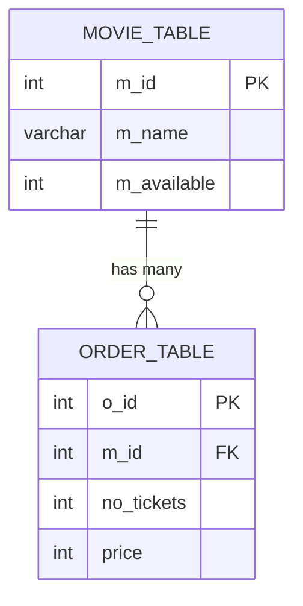
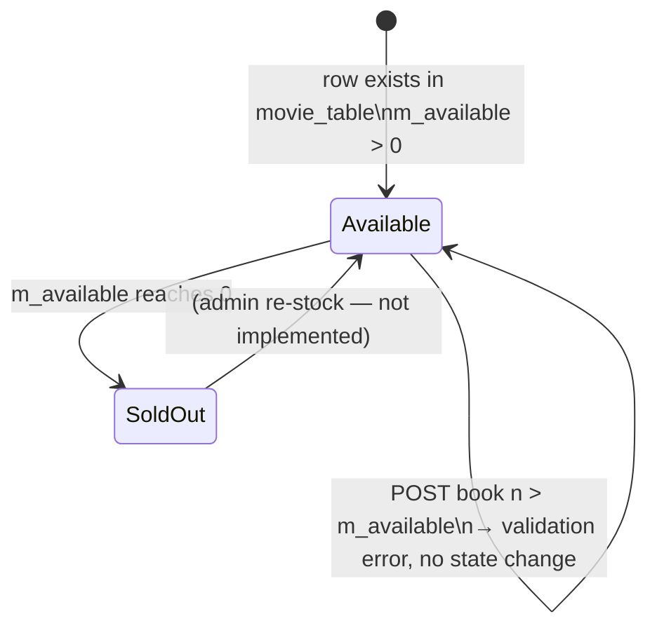

# Data Model

The application persists state in a MySQL database (configured by
[`config.yaml`](../../mulesoft/src/main/resources/config.yaml) and
[`global.xml`](../../mulesoft/src/main/mule/global.xml)). It uses two tables:
`movie_table` and `order_table`. Field names below are inferred from the SQL
statements in
[`implementation.xml`](../../mulesoft/src/main/mule/implementation.xml) and the
type metadata in
[`application-types.xml`](../../mulesoft/src/main/resources/application-types.xml).

## Entities

### `movie_table`

The catalogue of movies the system can sell tickets for.

| Column        | Type    | Notes                                                                     |
|---------------|---------|---------------------------------------------------------------------------|
| `m_id`        | INTEGER | Primary key. Referenced by `order_table.m_id`.                            |
| `m_name`      | VARCHAR | Human‑readable movie name (logical field `name` in the API contract).     |
| `m_available` | INTEGER | Number of seats still available. Decremented on successful booking.       |

Referenced by:

- `SELECT * FROM movie_table WHERE m_available > 0`  *(GetMovies)*
- `SELECT m_available FROM movie_table WHERE m_id = :m_id`  *(BookTickets — pre‑check)*
- `UPDATE movie_table SET m_available = m_available - :no_tickets WHERE m_id = :m_id` *(BookTickets — inventory decrement)*

### `order_table`

One row per successful ticket booking.

| Column       | Type    | Notes                                                                            |
|--------------|---------|----------------------------------------------------------------------------------|
| `o_id`       | INTEGER | Primary key, auto‑generated (used as `MAX(o_id)` to fetch the most recent row).  |
| `m_id`       | INTEGER | Foreign key to `movie_table.m_id`.                                               |
| `no_tickets` | INTEGER | Number of seats booked.                                                          |
| `price`      | INTEGER | Total price computed by tiered pricing (see [`business-logic.md`](business-logic.md#decision-pricing-tiers)). |

Referenced by:

- `INSERT INTO order_table (m_id, no_tickets, price) VALUES (...)`  *(BookTickets)*
- `SELECT * FROM order_table WHERE o_id = (SELECT MAX(o_id) FROM order_table)`  *(BookTickets — return latest order)*

## Relationships

Every order belongs to exactly one movie; a movie may have many orders. The
relationship is enforced logically via `m_id` (no explicit FK is created in
the legacy SQL, but the .NET migration should add one).



## DataWeave / API types

The Mule project also tracks a number of DataWeave types in
[`application-types.xml`](../../mulesoft/src/main/resources/application-types.xml).
The two that describe the public contract are:

### `auto_4c5336f2-..._Output-Payload` — `GET /movies` response item

```dw
type auto_4c5336f2_42e8_4240_8859_b812202afab2_Output_Payload = {|
  id?: String,
  name?: String,
  no_of_tickets?: Number {"typeId": "int"}
|} {"example": "{\"id\":\"1\",\"name\":\"abc\",\"no_of_tickets\":100}"}
```

This is the logical, API‑level view of a `movie_table` row.

### `auto_2df5fe63-..._Output-Payload` — `POST /movies/{m_id}` response

```dw
type auto_2df5fe63_8e10_4039_90b9_ff29a1be9856_Output_Payload =
  {| message?: String |}
  {"example": "{\"message\":\"ticket(s) booked\"}"}
```

The logical confirmation contract. *Note:* the implementation currently returns
the full latest `order_table` row instead — see
[`api-endpoints.md`](api-endpoints.md#2-post-apimoviesm_id--book-tickets).

### `odder_details` — internal booking variable

```dw
type odder_details = {|
  no_tickets: String,
  m_id: String
|} {"example": "{\"no_tickets\":\"1\",\"m_id\":\"2\"}"}
```

Matches the sample file
[`order_details.json`](../../mulesoft/src/main/resources/order_details.json):

```json
{ "no_tickets": "1", "m_id": "2" }
```

This is the shape of `vars.no_tickets` constructed at the top of the
`BookTickets` flow.

### `availableSeats` — sample type for validation step

```dw
type availableSeats = Array<String> {"example": "[\"1\"]"}
```

Matches [`sample.json`](../../mulesoft/src/main/resources/sample.json):

```json
["1"]
```

## Data lifecycle


