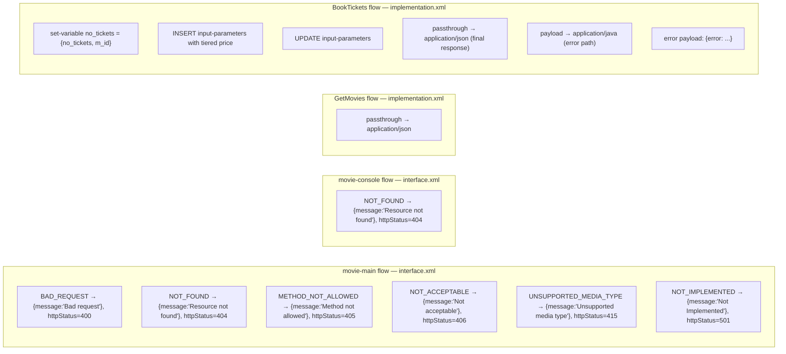
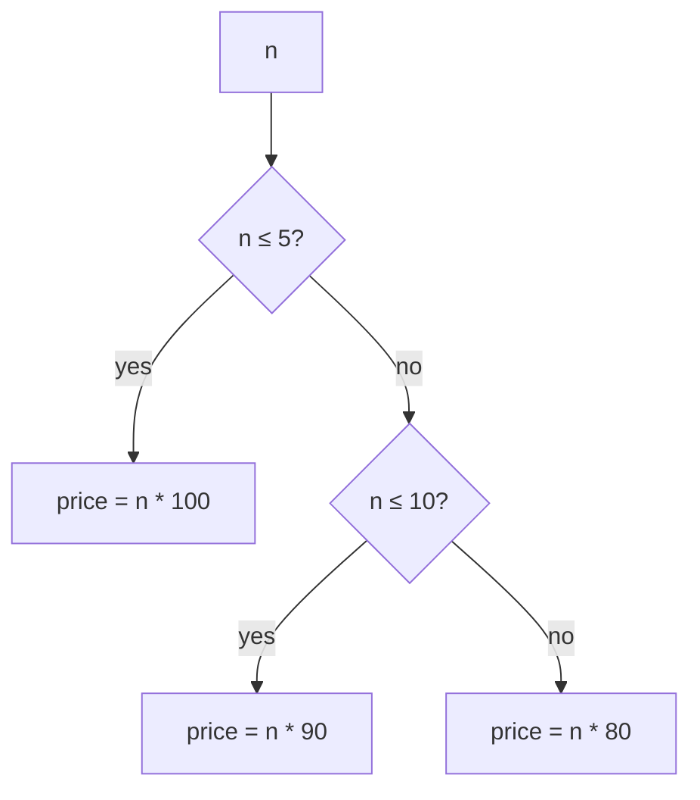

# DataWeave Transformations

The legacy application uses DataWeave 2.0 (`%dw 2.0`) for every payload and
variable transformation. This page summarises each script in the project,
where it lives, what it consumes, and what it produces.

## Where the transformations live



## Interface‑layer transformations (`interface.xml`)

Each APIkit error handler does the same thing: produce a `{ "message": "..." }`
JSON body and set `vars.httpStatus` for the outer HTTP listener to use.

### `APIKIT:BAD_REQUEST` → HTTP 400

```dw
%dw 2.0
output application/json
---
{ message: "Bad request" }
```

Sets `vars.httpStatus = "400"`.

### `APIKIT:NOT_FOUND` → HTTP 404

```dw
%dw 2.0
output application/json
---
{ message: "Resource not found" }
```

Sets `vars.httpStatus = "404"`. Used by both `movie-main` and
`movie-console`.

### `APIKIT:METHOD_NOT_ALLOWED` → HTTP 405

```dw
%dw 2.0
output application/json
---
{ message: "Method not allowed" }
```

Sets `vars.httpStatus = "405"`.

### `APIKIT:NOT_ACCEPTABLE` → HTTP 406

```dw
%dw 2.0
output application/json
---
{ message: "Not acceptable" }
```

Sets `vars.httpStatus = "406"`.

### `APIKIT:UNSUPPORTED_MEDIA_TYPE` → HTTP 415

```dw
%dw 2.0
output application/json
---
{ message: "Unsupported media type" }
```

Sets `vars.httpStatus = "415"`.

### `APIKIT:NOT_IMPLEMENTED` → HTTP 501

```dw
%dw 2.0
output application/json
---
{ message: "Not Implemented" }
```

Sets `vars.httpStatus = "501"`.

## `GetMovies` (implementation.xml)

### Result → JSON

```dw
%dw 2.0
output application/json
---
payload
```

- **Input:** Java list of rows produced by the `db:select`.
- **Output:** JSON array; field names follow the column names of `movie_table`.

## `BookTickets` (implementation.xml)

### Build the booking context variable

The first processor uses an inline DataWeave expression to build a small
object that bundles both inputs into a single variable named `no_tickets`:

```dw
{
    no_tickets: attributes.queryParams.no_tickets,
    m_id:       attributes.uriParams.m_id
}
```

This is the shape of the `odder_details` type in
[`application-types.xml`](../../mulesoft/src/main/resources/application-types.xml).

### `INSERT` input parameters (with tiered pricing)

```dw
{
   'm_id':       vars.no_tickets.'m_id'     as Number,
   'no_tickets': vars.no_tickets.no_tickets as Number,
   'price':
       if (vars.no_tickets.no_tickets as Number <= 5)  vars.no_tickets.no_tickets as Number * 100
       else if (vars.no_tickets.no_tickets as Number <= 10) vars.no_tickets.no_tickets as Number * 90
       else                                                  vars.no_tickets.no_tickets as Number * 80
}
```

Pricing schedule (let `n = no_tickets as Number`):



### `UPDATE` input parameters

```dw
{
    'm_id':       vars.no_tickets.'m_id'     as Number,
    'no_tickets': vars.no_tickets.no_tickets as Number
}
```

### Final response → JSON

```dw
%dw 2.0
output application/json
---
payload
```

Serialises the most‑recent row of `order_table` returned by the final
`SELECT`.

### Validation error path: payload → Java

```dw
%dw 2.0
output application/java
---
payload
```

Just re‑binds the payload as a Java object so the next `<set-payload>` can
reference `payload[0].m_available`. The actual error body is produced by the
`<set-payload>` expression, not by a DataWeave script:

```dw
output application/json
---
{
  "error": "avaible tickets is only $(payload[0].m_available) but you have ordered $(vars.no_tickets.no_tickets)"
}
```

Note: the literal string `"avaible"` is misspelled in the legacy source — the
.NET migration should fix it (e.g. `"available"`).

## Autogenerated DataWeave under `weave/`

The directory
[`mulesoft/src/main/resources/weave/autogenerated/`](../../mulesoft/src/main/resources/weave/autogenerated)
contains `.wev` files automatically produced by Anypoint Studio while editing
the two business flows (`GetMovies` and `BookTickets`). They capture sample
payloads/attributes/variables for design‑time type inference. They have no
runtime effect and do not need to be ported to .NET.

| Folder UUID                              | Flow            | Files                                                                                                                                                |
|------------------------------------------|-----------------|------------------------------------------------------------------------------------------------------------------------------------------------------|
| `4c5336f2-42e8-4240-8859-b812202afab2`   | `GetMovies`     | `Input-Attributes.wev`, `Input-Payload.wev`, `Input-Variables-outboundHeaders.wev`, `Output-Attributes.wev`, `Output-Variables-outboundHeaders.wev` |
| `2df5fe63-8e10-4039-90b9-ff29a1be9856`   | `BookTickets`   | `Input-Attributes.wev`, `Input-Payload.wev`, `Input-Variables-outboundHeaders.wev`, `Output-Attributes.wev`, `Output-Variables-outboundHeaders.wev` |
