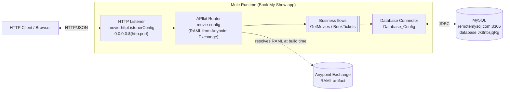

# Integrations

This document captures every external system the legacy MuleSoft application
interacts with, and the connectors used to do so.

## System context



## External dependencies

### HTTP Listener (inbound)

Defined in [`global.xml`](../../mulesoft/src/main/mule/global.xml):

```xml
<http:listener-config name="movie-httpListenerConfig">
    <http:listener-connection host="0.0.0.0" port="${http.port}"/>
</http:listener-config>
```

Used by both `movie-main` (path `/api/*`) and `movie-console` (path `/console/*`)
in [`interface.xml`](../../mulesoft/src/main/mule/interface.xml). The port is
parameterised by `http.port` in
[`config.yaml`](../../mulesoft/src/main/resources/config.yaml) (default `8081`).

### MySQL database

Defined in `global.xml`:

```xml
<db:config name="Database_Config">
    <db:my-sql-connection host="${db.host}" port="${db.port}"
                          user="${db.user}" password="${db.pass}"
                          database="${db.database}"/>
</db:config>
```

The connection coordinates come from `config.yaml`. The current values point
to a public `remotemysql.com` instance. The `BookTickets` flow uses
`SELECT` / `INSERT` / `UPDATE` operations sequentially without an explicit
transaction; a modern re‑implementation should wrap these in a single
transaction.

Schema is documented in [`data-model.md`](data-model.md).

### Anypoint Exchange — RAML API contract

`interface.xml` references the RAML contract by Exchange coordinates:

```xml
<apikit:config name="movie-config"
               api="resource::dd352549-b3e6-4dd6-b86f-85ed018825af:movie:1.0.0:raml:zip:movie.raml"
               outboundHeadersMapName="outboundHeaders"
               httpStatusVarName="httpStatus"/>
```

This artifact (`dd352549-b3e6-4dd6-b86f-85ed018825af:movie:1.0.0:raml`) is
pulled from Anypoint Exchange at build time by Maven (see
`mulesoft/pom.xml`). It is **not** publicly available, which means a fresh
checkout cannot resolve dependencies without Anypoint credentials. The .NET
migration should re‑author the contract as OpenAPI.

## Connectors / modules in use

| Connector / module        | Namespace                                                         | Purpose                                                  |
|---------------------------|-------------------------------------------------------------------|----------------------------------------------------------|
| HTTP Listener             | `http://www.mulesoft.org/schema/mule/http`                        | Inbound HTTP endpoint for `/api/*` and `/console/*`      |
| Database (MySQL)          | `http://www.mulesoft.org/schema/mule/db`                          | All persistence operations                               |
| APIkit                    | `http://www.mulesoft.org/schema/mule/mule-apikit`                 | RAML‑driven routing and API console                      |
| Validation                | `http://www.mulesoft.org/schema/mule/validation`                  | `is-true` predicate check for available seats            |
| Mule EE Core (DataWeave)  | `http://www.mulesoft.org/schema/mule/ee/core`                     | `ee:transform` for payload/variable shaping              |
| Core                      | `http://www.mulesoft.org/schema/mule/core`                        | `flow`, `set-variable`, `set-payload`, `logger`, etc.    |
| Documentation             | `http://www.mulesoft.org/schema/mule/documentation`               | `doc:name` / `doc:id` metadata                           |

## Configuration

[`config.yaml`](../../mulesoft/src/main/resources/config.yaml) holds the
externalised settings consumed via `${...}` placeholders:

```yaml
http:
  port: '8081'
db:
  port: '3306'
  host: 'remotemysql.com'
  user: '<redacted in docs>'
  pass: '<redacted in docs>'
  database: '<redacted in docs>'
```

> ⚠️ **Security note:** the real `config.yaml` checked into the repository
> contains plain‑text database credentials for a shared `remotemysql.com`
> account. The .NET migration must move these to a secret store (e.g. Azure
> Key Vault / AWS Secrets Manager / environment variables) and rotate the
> credentials. They are intentionally redacted in this documentation.

## Logging

Logging is configured by
[`log4j2.xml`](../../mulesoft/src/main/resources/log4j2.xml). The only
explicit application logger call is in the `GetMovies` flow
(`<logger level="INFO" .../>`). The .NET re‑implementation should add
structured logging at flow boundaries and around the SQL calls.

## No other outbound integrations

There are no other outbound connectors (no message queues, no SaaS APIs, no
file system writes, no caches). The full external surface area of the legacy
application is **HTTP in + MySQL out**.
