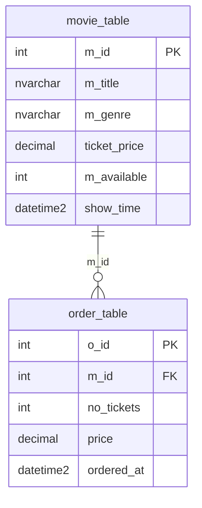

# SQL / Entity Framework Core schema (`src/sql`)

This folder contains an EF Core SQL Server schema project for the modernized API data model derived from the Mule flows (`movie_table`, `order_table`) and `order_details.json`.

## Project layout

- `AppMod.Data/` - EF Core class library with entities, `DbContext`, Fluent mapping, and migrations
- `seed/mock_data.sql` - optional SQL seed script with representative mock data

## Prerequisites

- .NET SDK 8+
- SQL Server / Azure SQL reachable from your environment

## Build

```bash
cd src/sql

dotnet build AppMod.Sql.slnx
```

## EF Core commands

```bash
cd src/sql

dotnet tool restore

# Create a new migration

dotnet tool run dotnet-ef migrations add <MigrationName> \
  --project AppMod.Data/AppMod.Data.csproj \
  --startup-project AppMod.Data/AppMod.Data.csproj \
  --output-dir Migrations

# Apply migrations to the configured SQL Server database

dotnet tool run dotnet-ef database update \
  --project AppMod.Data/AppMod.Data.csproj \
  --startup-project AppMod.Data/AppMod.Data.csproj

# Produce SQL migration script

dotnet tool run dotnet-ef migrations script \
  --project AppMod.Data/AppMod.Data.csproj \
  --startup-project AppMod.Data/AppMod.Data.csproj
```

> The current model includes `HasData` seed records. They are applied through migrations/database update.

## Applying seed data script

If you want to apply or re-apply representative mock rows manually:

```bash
sqlcmd -S <server> -d <database> -i src/sql/seed/mock_data.sql
```

## Entity relationship diagram


